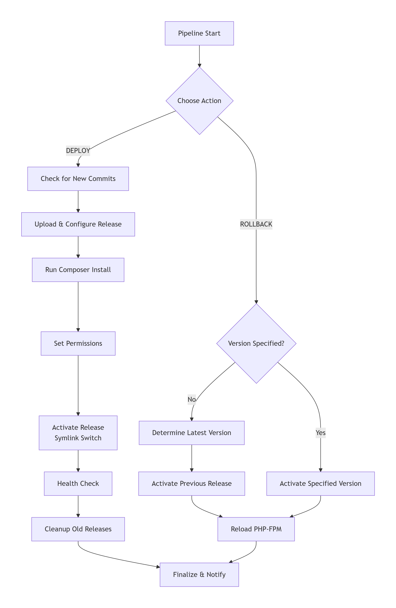

# jenkins-cicd-pipeline
Professional Jenkins CI/CD Pipeline for PHP Application Deployment
# Jenkins CI/CD Pipeline for PHP Application Deployment

A professional, production-ready Jenkins Pipeline implementing zero-downtime deployments, automated rollback, and comprehensive monitoring for PHP applications.

##  Pipeline Architecture



##  Key Features

###  **Zero-Downtime Deployment**
- **Symlink Switching**: Atomic deployment activation using symbolic links
- **Blue-Green Style**: Maintains previous release until new one is verified
- **Health Checks**: Automated application verification before cutover

###  **Intelligent Rollback System**
- **One-Click Rollback**: Revert to previous version with single parameter
- **Version-Specific Rollback**: Target any specific historical release
- **Automatic Cleanup**: Remove failed deployments automatically

###  **Security & Compliance**
- **SSH Agent Integration**: Secure credential management
- **Least Privilege**: Granular sudo permissions for specific commands
- **Audit Trail**: Complete deployment history and rollback logging

###  **Monitoring & Alerting**
- **Email Notifications**: Start, success, and failure notifications
- **Health Monitoring**: HTTP status checks with configurable retries
- **Performance Metrics**: Deployment timing and success rates

##  Pipeline Stages

### **DEPLOYMENT Flow**
1. **Pre-flight Checks**
   - Server connectivity verification
   - New commit detection (prevents duplicate deployments)
   - Sudo privileges validation

2. **Release Preparation**
   - Timestamped release directory creation
   - Secure file transfer via rsync with checksum verification
   - Composer dependency installation (production-optimized)

3. **Configuration & Permissions**
   - Environment configuration via symlinks
   - Secure file permission management (nginx:nginx ownership)
   - Special handling for Laravel storage/cache directories

4. **Activation & Verification**
   - Atomic symlink switching for zero downtime
   - PHP-FPM service reload
   - Comprehensive health checks with retry logic

5. **Cleanup**
   - Automatic retention of last 6 releases
   - Failed deployment cleanup

### **ROLLBACK Flow**
1. **Version Detection**
   - Automatic previous version identification
   - Validation of target release existence
   - Rollback history tracking

2. **Safe Rollback Execution**
   - Symlink reversion with proper permissions
   - Service reload
   - Optional cleanup of failed release

##  Technical Implementation

### **Core Technologies**
- **Jenkins Pipeline**: Declarative pipeline with Groovy DSL
- **SSH/Rsync**: Secure file transfer and remote execution
- **PHP/Laravel**: Optimized for PHP application deployment
- **Nginx**: Web server integration with proper ownership

### **Security Features**
```groovy
// Credential Management
sshagent(['remote-server-ssh']) {
    // All remote commands execute with secure credentials
}

// Sudo Privilege Control
sudo -l | grep -E 'touch|chown|chmod|tee|ln|rm|mkdir|systemctl'